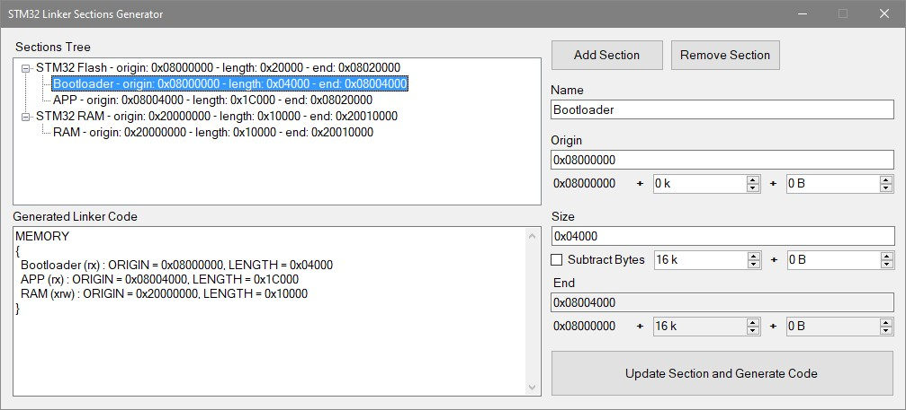
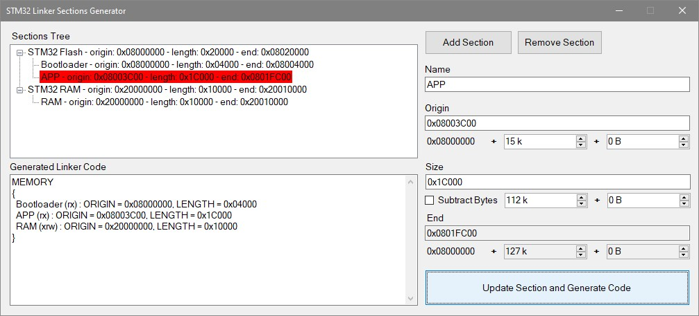

# STM32 Linker Sections Generator

This is a simple tool to generate linker-script sections. 
It can be used for example for the Stm32 Cube IDE. 
When defining the sections with this tool, it will also check, if you made any errors,
so sections would overlap, or the sections do not fit in the memory.

Check out the [Releases](https://github.com/Nikfinn99/STM32-Linker-Sections-Generator/releases) page for the compiled binaries, which can be executed on any windows machine.

This tool is written using C# in Visual Studio 2019 using .Net Framework and Windows Forms.

## Why would you separate your flash memory or ram into multiple sections?

The most common usage would be, if you have a custom bootloader. 
Bootloaders are usually placed at the beginning of the flash memory, and the app begins after that.

You could also have multiple applications in your flash and you decide at boot time, which one to execute.

Another usage would be to have some static data, like images and fonts for a display, stored in some section of the flash, which gets only programmed one single time and then never overridden by the application.
  

This could be done by hand, but then you have to calculate the correct offsets and length by yourself, which gets tedious when implementing a complicated configuration.
Manually calulating these numbers could also lead to errors, which can be checked for by this program.

## Examples using the tool

### Example layout with an app and a bootloader
The Flash is configured to have 128KB of Memory, of which 16KB are occupied by the bootloader and 112KB by the Application. 

### Error in the configuration
The app overlaps with the bootloader so the APP section is marked red in the Sections Tree Viewer. 

